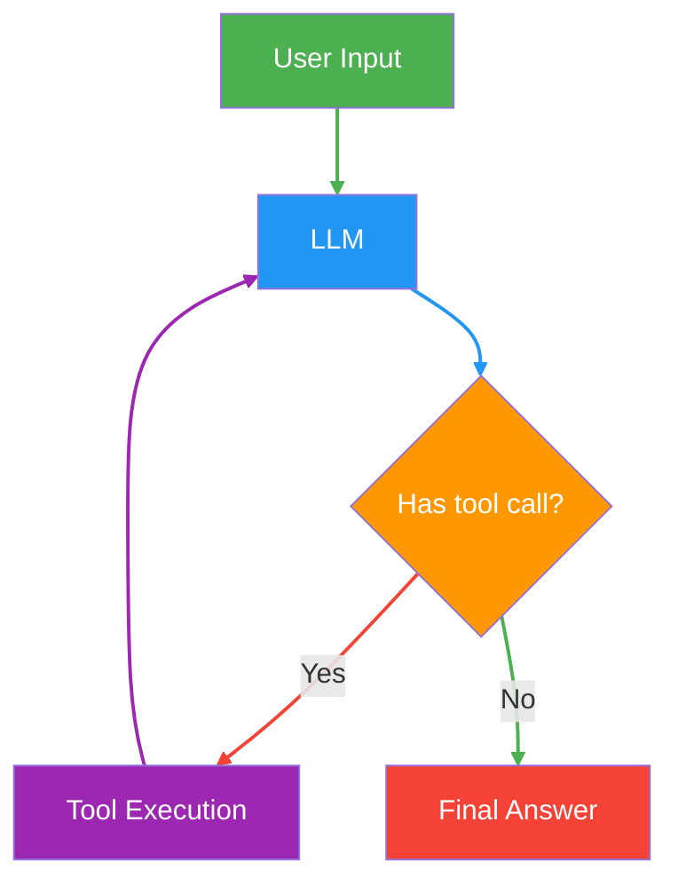

# LANGGRAPH
In this module we will learn in depth about LangGraph framework and how it is revolutionizing the development of ai agents. This course is taught by Nitesh and the link to the courses are provided below.  
- [LangGraph Playlist](https://www.youtube.com/watch?v=yC36gN-rqjo&list=PLKnIA16_RmvYsvB8qkUQuJmJNuiCUJFPL&index=2)

## What is LangGraph?  
LangGraph is an orchestration framework for building **intelligent**, **stateful** and **multi-step LLM workflows**. It enabales advanced features like **parallelism**, **loops**, **branching**, **memory**, and, **resumability** making it ideal for Agentic Application. It models your logic as a **graph of nodes**(tasks) and **edges**(routing) instead of a linear chain.  

